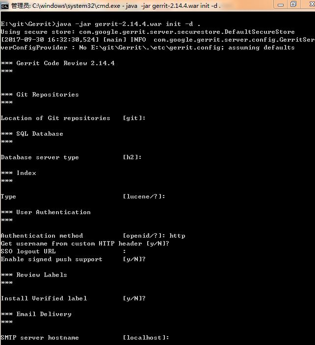
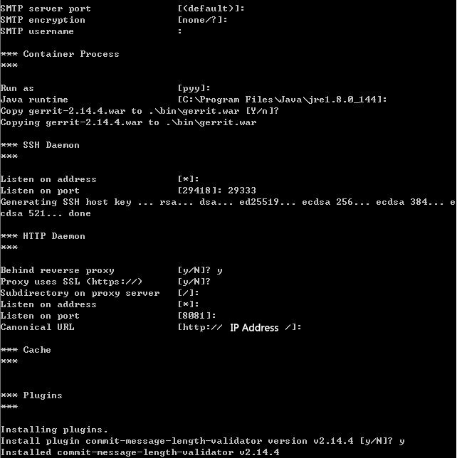
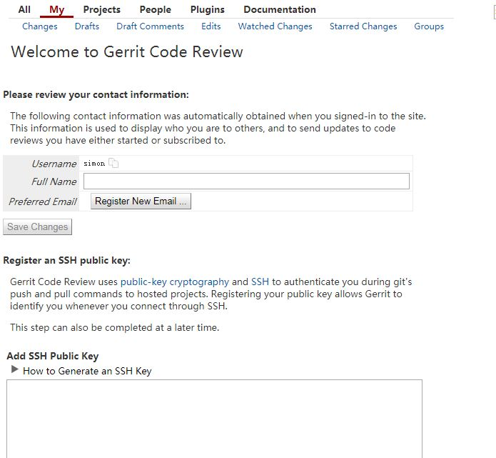

# How to install Gerrit on Windows
>The guide show how to install gerrit on the Windows OS.  
>**Since my OS is 64bit, so if yours is 32bit, please download the softwares in right version.**

## Prepare
OS: Windows 7 sp1  
Download bellow Softwares:  
* [Git-2.14.2-64-bit.exe](https://git-scm.com/downloads)  
* [gerrit-2.14.4.war](https://gerritcodereview.com/releases/2.14.md) Maybe Chinese cannot access this websites directly.   
* [httpd-2.4.27-Win64-VC15.zip](https://www.apachelounge.com/download/VC15/binaries/httpd-2.4.27-Win64-VC15.zip) Apache httpd needs install [the latest C++ Redistributable Visual Studio 2017](https://go.microsoft.com/fwlink/?LinkId=746572).  
**When you met the C++ Redistributable cannot setup issue, you should run the System update first, then you can install it successfully.**  

## Setup  
Please create a folder ```git``` in hard drive.  
Like ```E:/git```, bellow content based on this example.  
**1. install git tool**  
Install it into ```E:/git/Git```  
  
   
   
Then leave the defaults setting and intall it.
  
**2. Install gerrit**  
Move **gerrit-2.14.4.war** into ```E:/git/Gerrit/```  
Press ```left-shift + Right Click``` to open the command line in current folder.  
Run bellow command: ```java -jar gerrit-2.14.4.war init -d .```   
   
   
   
Then many folders will extract and it will generate ```etc/gerrit.config```.   
Content as follows:  
<pre>
[gerrit]
	basePath = git
	serverId = 6d719b1e-ef1e-4a76-9a01-8a19f0e0e834
	canonicalWebUrl = http://Your IP address/
[database]
	type = h2
	database = E:\\git\\Gerrit\\db\\ReviewDB
[index]
	type = LUCENE
[auth]
	type = HTTP
[receive]
	enableSignedPush = false
[sendemail]
	smtpServer = localhost
[container]
	user = pyy
	javaHome = C:\\Program Files\\Java\\jre1.8.0_144
[sshd]
	listenAddress = *:29333
[httpd]
	listenUrl = proxy-http://*:8081/
[cache]
	directory = cache
</pre>

**3. Install httpd**  
Extract **httpd-2.4.27-Win64-VC15.zip** to ```E:/git/Apache/```.  
Install ```the latest C++ Redistributable Visual Studio 2017```. 
Enter into ```E:/git/Apache/bin/```, then open command line in this current path.  
Modify ```conf/httpd.conf``` file as follows:  
<pre>
ServerRoot "E:/git/Apache"

LoadModule proxy_module modules/mod_proxy.so
LoadModule proxy_balancer_module modules/mod_proxy_balancer.so
LoadModule proxy_connect_module modules/mod_proxy_connect.so
LoadModule proxy_ftp_module modules/mod_proxy_ftp.so
LoadModule proxy_http_module modules/mod_proxy_http.so
LoadModule rewrite_module modules/mod_rewrite.so
LoadModule slotmem_shm_module modules/mod_slotmem_shm.so
LoadModule socache_shmcb_module modules/mod_socache_shmcb.so
LoadModule ssl_module modules/mod_ssl.so

DocumentRoot "E:/git/Apache/htdocs"
<Directory "E:/git/Apache/htdocs">
ScriptAlias /cgi-bin/ "E:/git/Apache/cgi-bin/"
</pre>  
Execute bellow command: ```httpd.exe -k isntall```.  
It will show bellow message when installed successfully.  
  
Then add gerrit reference things in ```conf/httpd.conf```:  

	<VirtualHost *:80>  
	    ServerName Your IP Address, the same with gerrit.config "canonicalWebUrl"
	    ProxyPreserveHost On  
	    <Proxy *> 
	        Order deny,allow  
	        Allow from all  
	    </Proxy>  
	    <Location /login/>  
	        AuthType Basic  
	        AuthName "Welcome to Gerrit Code Review!"  
	        Require valid-user  
	        AuthBasicProvider file  
	        AuthUserFile E:/git/gerrit_password  
	    </Location> 
	 
	    AllowEncodedSlashes On  
	    ProxyPass / http://127.0.0.1:8081/ nocanon  
	</VirtualHost>  

**4. Create gerrit_password**  
Execute the command in the command line: ```E:\git\Apache\bin>htpasswd.exe -c -b E:/git/gerrit_password USER PASSWORD```  
It will create the user/password file ```gerrit_password``` into **E:/git/**.

## Start Service
**1. start gerrit**  
Execute the command into command line: ```E:\git\Gerrit\bin>gerrit.sh start```.
You can find the log "**Starting Gerrit Code Review: OK**" at Git-Bash window.  
Or you can check the ```logs``` folder, there is a **gerrit.run** file.

**2. start httpd**  
Execute the command into command line: ```E:\git\Apache\bin>httpd.exe -k start```.  
Or you can execute ```bin/ApacheMonitor.exe``` to start the service.

## Verify
You can input ```Your IP Address``` into your browser.  
If OK, you will see bellow picture:  

 
  
